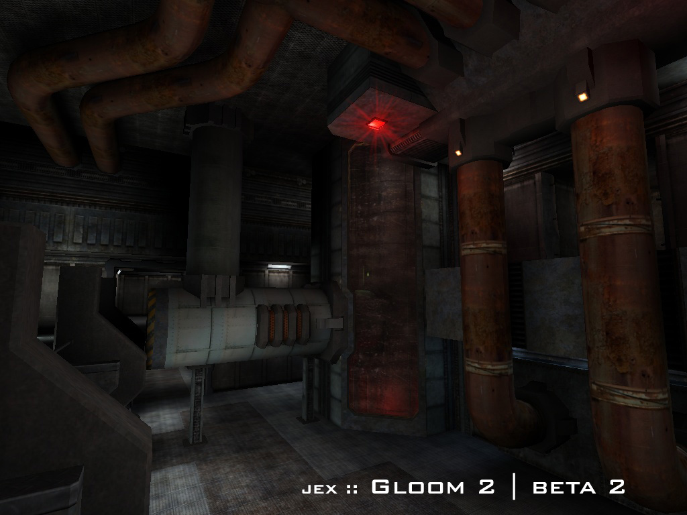

Gloom2
======

This is a map ported from the [Tremulous](https://tremulous.net) game to the [Unvanquished](https://unvanquished.net) game. It is a remake of the gloom2 map from the [Gloom](http://www.planetgloom.com) game.

It features a dark gritty outpost on a distant planet.

It is ported from:

- `map-gloom2beta2.pk3`
- `gloom2.map`

This port is an Interstellar Oasis initiative: [github.com/InterstellarOasis/InterstellarOasis](https://github.com/InterstellarOasis/InterstellarOasis).

This port is **work in progress**.

Levelshot
---------

Credits
-------

Unvanquished port:

* Thomas “illwieckz” Debesse (http://gg.illwieckz.net)
  <hidden mail="dev ad illwieckz.net"/>

Mapping:

* Nicolas “Jex“ Jansens
  <hidden mail="elfsoup ad gmail.com"/> <hidden mail="jex ad orodu.net"/>

Textures:

* Nicolas “Jex“ Jansens
* Randy “ydnar” Redding (http://www.shaderlab.com)
  <hidden mail="ydnar ad shaderlab.com"/>
* Yves “evil lair” Allaire (http://evillair.net)
* The nice chap who released his "ds-old-tex" set to the public
* Some texture authors that were failed to be identified

Special thanks:

* rex for the original gloom2
* whitenoise for the original gloom2

See the raw file for email addresses.

Legal
-----

Changes by Thomas Debesse fall under the Internet Systems Consortium License:  
http://directory.fsf.org/wiki/License:ISC

Map and Textures (`es_`) by Nicolas Jansens fall under the Creative Commons Attribution-ShareAlike 2.5 Generic License:  
http://creativecommons.org/licenses/by-sa/2.5/

Assets by Tremulous contributors fall under the Creative Commons Attribution-ShareAlike 2.5 Generic License:  
http://creativecommons.org/licenses/by-sa/2.5/

Textures by Randy Reddig fall under the Creative Commons Attribution-ShareAlike 2.5 Generic License:  
http://creativecommons.org/licenses/by-sa/2.5/

Textures by Yves Allaire fall under the Creative Commons Attribution-ShareAlike 4.0 International License:  
http://creativecommons.org/licenses/by-sa/4.0/

See [about/gloom2.txt](about/gloom2.txt) for details.

History
-------

* 2006-05-31 Gloom2 beta2
* 2006-05-23 Gloom2 beta1
